# Laporan Pertemuan 10 Sistem Operasi

<h4>Nama : Deswita Khansa Rafifah<h4>
<h4>NIM : 254107020151<h4>
<h4>Kelas : TI-1G<h4>

## Praktikum
### Praktikum 10.1 Melihat Penggunaan Memori
1. Jalankan free -h untuk melihat ringkasan RAM dan swap
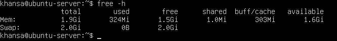

2. Lihat detail memori dari kernel melalui /proc/meminfo.
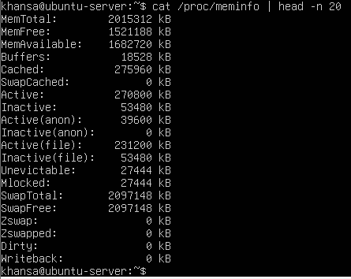

**Analisis:**
1. Hitung persentase memori tersedia: available / total × 100%. Jika hasilnya di bawah 10%, sistem mulai kekurangan memori.
    - Jawab: Hasilnya 83,5%, jauh di atas 10%, sehingga sistem tidak kekurangan memori dan berjalan dalam kondisi normal.

2. Pada baris Swap, apakah kolom used bernilai 0? Jika lebih dari 0, kernel sudah pernah memindahkan data ke disk karena RAM tidak cukup.
    - Jawab: Nilai used pada baris Swap adalah 0 (nol). Artinya kernel belum pernah memindahkan data ke disk karena RAM masih sangat mencukupi kebutuhan semua proses yang berjalan.

3. Perhatikan field Cached dan Buffers di /proc/meminfo. Nilai ini sesuai dengan kolom buff/cache pada free -h.
    - Jawab: Field Cached dan Buffers di /proc/meminfo:
        - Buffers: 18.528 kB.
        - Cached: 275.960 kB.
        - Total: 18.528 + 275.960 = 294.488 kB ≈ 303Mi
    - Nilai ini sesuai dengan kolom buff/cache pada output free -h yang menunjukkan 303Mi, membuktikan bahwa kedua perintah membaca sumber data yang sama dari kernel.

### Studi Kasus 10.1 Server Lambat karena Memori
1. Periksa kondisi memori secara keseluruhan.
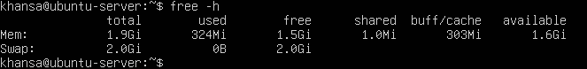

2. Pantau proses secara real-time.
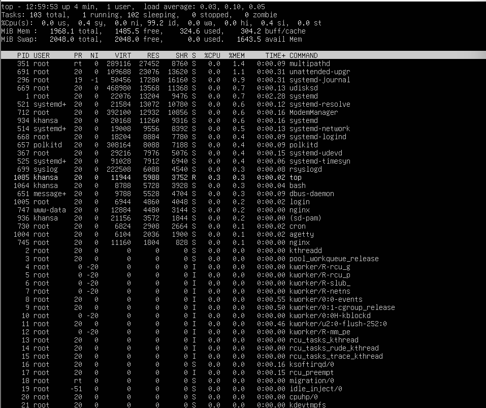

**Analisis:**
1. Apakah nilai available sangat kecil (misalnya di bawah 200 MB pada server dengan RAM 2 GB)? Jika ya, server kemungkinan kekurangan memori.
    - Jawab: Nilai available = 1643.5 MiB ≈ 1,6 GB, jauh di atas 200 MB. Jadi server tidak kekurangan memori dan bukan kekurangan RAM sebagai penyebab kelambatan.

2. Apakah kolom used pada baris Swap lebih dari 0? Jika ya, kernel sedang menggunakan swap, yang berarti performa menurun.
    - Jawab: Nilai used pada Swap = 0. Kernel tidak sedang menggunakan swap, sehingga tidak ada penurunan performa akibat akses disk dari swap.

3. Di tampilan top, proses apa yang memiliki %MEM terbesar? Proses tersebut menjadi kandidat utama penyebab lambatnya server.
    - Jawab: Proses dengan %MEM tertinggi adalah multipathd (PID 351) milik root dengan nilai 1.4%, diikuti unattended-upgr (PID 691) sebesar 1.1% dan systemd-journal (PID 296) sebesar 0.8%. Nilai-nilai ini sangat kecil, tidak ada satu proses pun yang mendominasi penggunaan memori secara signifikan.

### Praktikum 10.2 Mengamati Aktivitas Paging
1. Jalankan vmstat dengan interval 1 detik, 5 sampel.
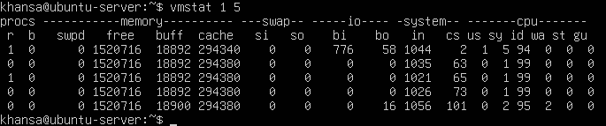

**Analisis:**
1. Amati nilai si dan so pada kelima baris. Pada sistem normal dengan RAM cukup, kedua nilai ini selalu 0.
    - Jawab: Seluruh nilai si dan so pada kelima baris adalah 0. Ini merupakan kondisi normal, tidak ada data yang dipindahkan antara RAM dan swap, menandakan RAM masih sangat mencukupi untuk semua proses yang berjalan.

2. Jika nilai si atau so sesekali muncul lebih dari 0, artinya pernah ada aktivitas swap. Ini masih wajar jika tidak terus-menerus.
    - Jawab: Pada sistem ini tidak terjadi sama sekali. Nilai tetap 0 di semua sampel, sehingga tidak ada aktivitas swap yang perlu dikhawatirkan.

3. Jika si dan so terus-menerus lebih dari 0, sistem dalam kondisi memory pressure serius — performa turun drastis karena akses disk jauh lebih lambat dari RAM.
    - Jawab: Kondisi ini tidak terjadi pada sistem kamu. Artinya sistem tidak berada dalam kondisi memory pressure — performa berjalan normal tanpa ketergantungan pada akses disk yang lambat.

4. Perhatikan juga kolom free (RAM kosong) dan buff (buffer) untuk memahami kondisi keseluruhan RAM saat itu.
    - Jawab: Nilai free pada setiap baris berkisar di angka 1.520.716 kB ≈ 1,5 GB dan buff sekitar 18.892 kB. RAM kosong sangat besar, yang menjelaskan mengapa si dan so selalu 0 — kernel tidak perlu menggunakan swap sama sekali.

### Praktikum 10.3 Membuat dan Mengonfigurasi Swap File
1. Buat file berukuran 512 MB sebagai calon swap.
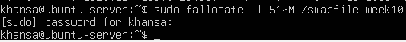

2. Atur permission file menjadi 600 — hanya root yang boleh membaca dan menulis.
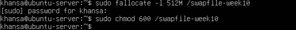

3. Format file sebagai area swap, lalu aktifkan.
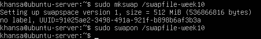

4. Verifikasi swap aktif. Anda akan melihat entri /swapfile-week10 dengan ukuran 512M, dan nilai total pada baris Swap di free -h bertambah 512M.
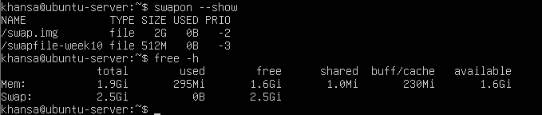

5. Periksa nilai swappiness, ubah sementara, dan verifikasi perubahan.
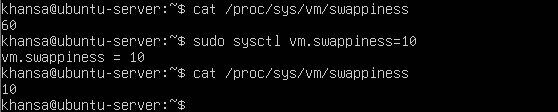

**Analisis:**
1. Berapa nilai swappiness default? Apa artinya bagi perilaku kernel dalam menggunakan swap?
    - Jawab: Nilai swappiness default adalah 60. Artinya kernel cukup agresif dalam memindahkan data dari RAM ke swap — bahkan saat RAM masih tersedia sekitar 40%, kernel sudah mulai menggunakan swap. Nilai ini cocok untuk desktop umum namun kurang ideal untuk server aplikasi yang membutuhkan performa konsisten.

2. Setelah diubah ke 10, konfirmasi nilai berubah pada output cat kedua. Apa dampak nilai 10 terhadap penggunaan swap dibanding nilai 60?
    - Jawab: Output cat kedua menampilkan 10, membuktikan perubahan berhasil diterapkan. Dengan nilai 10, kernel jauh lebih hemat dalam menggunakan swap — hanya akan memindahkan data ke swap jika RAM benar-benar hampir habis. Dibanding nilai 60, performa aplikasi lebih stabil karena akses disk yang lambat diminimalkan.

3. Apakah entri /swapfile-week10 muncul di swapon –show? Jika tidak, pastikan Langkah 2 (chmod 600) sudah dijalankan sebelum Langkah 3.
    - Jawab: Ya, entri /swapfile-week10 berhasil muncul dengan ukuran 512M dan USED 0B. Ini membuktikan langkah chmod 600 sudah dijalankan dengan benar sebelum mkswap, sehingga swap berhasil diaktifkan tanpa error.

### Praktikum 10.4 Monitoring Memory
1. Ambil snapshot proses diurutkan dari penggunaan memori terbesar.
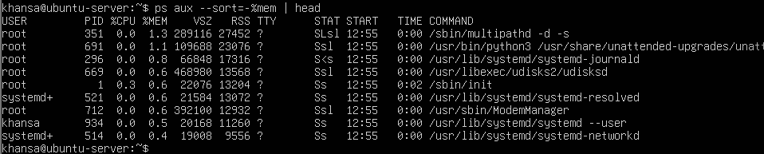

2. Pantau secara real-time dengan top.
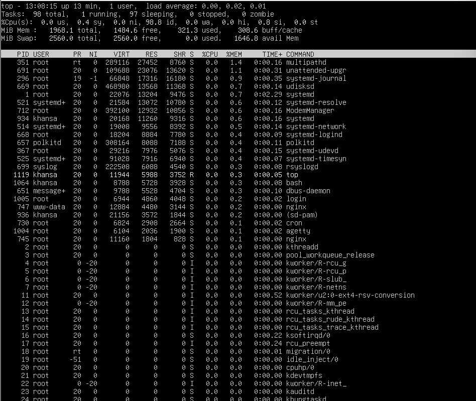
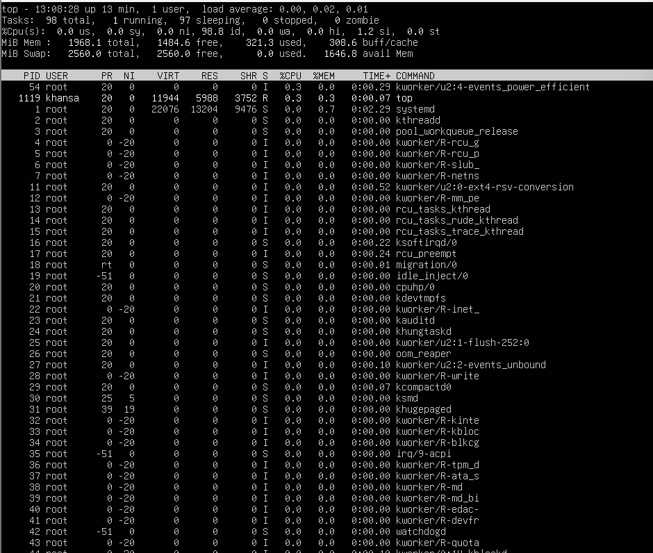

**Analisis:**
1. Proses apa yang berada di urutan pertama? Catat nilai %MEM dan RSS-nya.
    - Jawab: Proses di urutan pertama adalah multipathd (PID 351) milik root dengan nilai %MEM = 1.3 dan RSS = 27.452 KB.

2. Konversikan RSS dari KB ke MB (bagi 1024). Misalnya, RSS=524288 berarti proses menggunakan 512 MB RAM. Apakah wajar untuk jenis program tersebut?
    - Jawab: 27.452÷1024≈26,8 MB. Nilai ini sangat wajar untuk proses multipathd — yaitu daemon pengelola multipath storage yang memang hanya membutuhkan memori kecil untuk berjalan di background.

3. Mengapa VSZ selalu lebih besar dari RSS pada proses yang sama?
    - Jawab: VSZ mencakup seluruh ruang memori virtual yang dialokasikan proses, termasuk bagian yang belum dimuat ke RAM, shared library yang di-map, dan area memori yang direservasi. Sedangkan RSS hanya menghitung halaman memori yang benar-benar berada di RAM fisik saat itu. Karena tidak semua memori virtual perlu dimuat sekaligus, RSS selalu lebih kecil dari VSZ.

4. Apakah urutan proses di ps konsisten dengan tampilan top saat diurutkan berdasarkan %MEM?
    - Jawab: Ya, urutan keduanya konsisten — multipathd tetap di posisi teratas dengan %MEM 1.4% di top, diikuti unattended-upgr 1.1%, dan systemd-journal di bawahnya. Perbedaan kecil angka antara ps dan top wajar karena ps adalah snapshot satu waktu sedangkan top terus diperbarui secara real-time.

### Praktikum 10.5 Script Monitor Memori
1. Masuk ke direktori kerja dan buat file script:
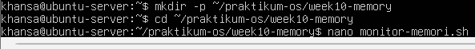

2. Ketik script berikut:
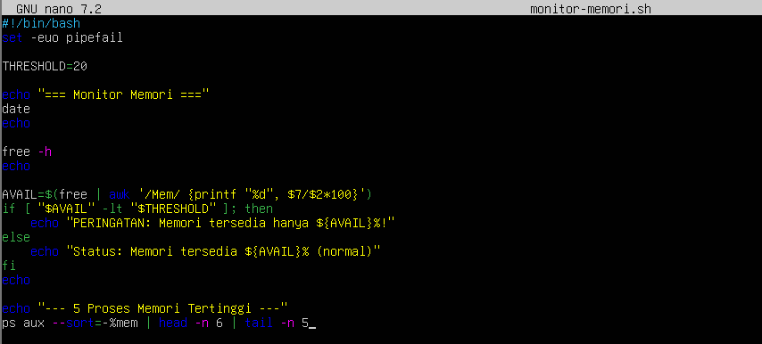

3. Uji
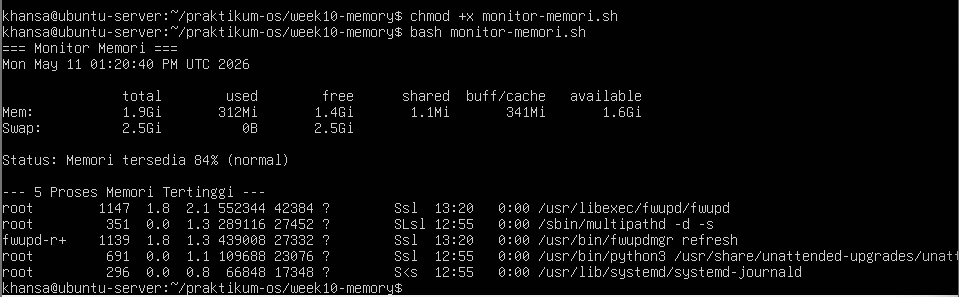

**Analisis:**
1. Variabel THRESHOLD=20 menetapkan batas persentase. Perintah free | awk ’/Mem/ {printf "%d", $7/$2*100}’ mengambil kolom ke-7 (available) dibagi kolom ke-2 (total) dari baris Mem, lalu dikalikan 100 untuk menghasilkan persentase bilangan bulat.
    - Jawab: Variabel THRESHOLD=20 menetapkan batas minimum 20% sebagai ambang peringatan. Perintah free | awk '/Mem/ {printf "%d", $7/$2*100}' membaca baris Mem, mengambil kolom ke-7 (available = 1.6Gi) dibagi kolom ke-2 (total = 1.9Gi) lalu dikali 100, menghasilkan 84 sebagai bilangan bulat persentase.

2. Kondisi if [ "$AVAIL" -lt "$THRESHOLD" ] bernilai benar jika persentase memori tersedia di bawah 20.
    - Jawab: Kondisi ini bernilai false karena 84 tidak kurang dari 20, sehingga script menampilkan pesan Status: Memori tersedia 84% (normal) — bukan peringatan. Sistem dalam kondisi sehat.

3. Ubah THRESHOLD menjadi 90 dan jalankan ulang. Apa yang berubah pada output? Mengapa demikian?
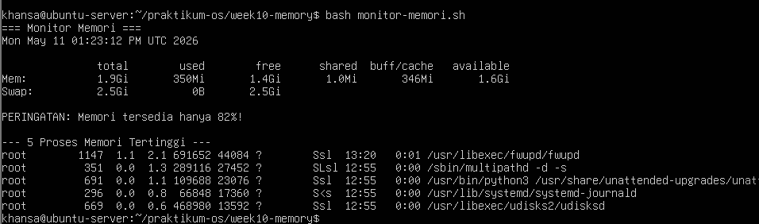
    - Jawab: Setelah THRESHOLD diubah ke 90 dan script dijalankan ulang, output berubah dari pesan "Status: Memori tersedia 84% (normal)" menjadi "PERINGATAN: Memori tersedia hanya 82%!" karena kondisi if [ "$AVAIL" -lt "$THRESHOLD" ] kini bernilai benar — nilai 82 kurang dari 90 — sehingga blok peringatan dieksekusi. Padahal kondisi memori sebenarnya masih sangat sehat, yang membuktikan bahwa nilai threshold terlalu tinggi akan memicu peringatan palsu dan tidak mencerminkan kondisi sistem yang sesungguhnya.

### Studi Kasus 10.2 Gagal Akses File
1. Buat direktori dan file konfigurasi contoh.
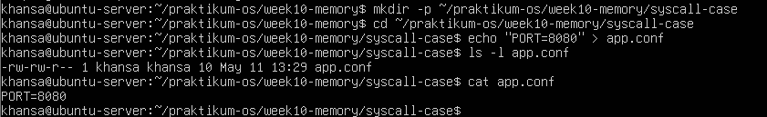

2. Simulasikan permission bermasalah.
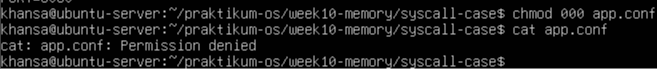

3. Kembalikan permission dan verifikasi.
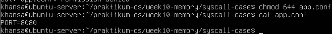

**Analisis:**
1. Mengapa cat menghasilkan Permission denied setelah chmod 000? System call apa yang gagal?
    - Jawab: Setelah chmod 000 menghapus semua bit izin akses, perintah cat mencoba membuka file melalui system call openat(). Kernel memeriksa permission bit dan menemukan tidak ada bit baca (r) untuk siapapun, sehingga kernel menolak permintaan dan mengembalikan error EACCES — yang ditampilkan sebagai pesan Permission denied di terminal.

2. Apa perbedaan pesan error Permission denied vs No such file or directory? Coba rm app.conf lalu cat app.conf untuk melihat perbedaannya.
    - Jawab: Permission denied berarti file ada di sistem namun proses tidak memiliki hak akses untuk membukanya — system call openat() gagal dengan error EACCES. Sedangkan No such file or directory berarti file tidak ditemukan sama sekali di path yang diberikan — system call gagal dengan error ENOENT. Keduanya butuh penanganan yang berbeda saat debugging.

3. Permission 644 berarti apa untuk owner, group, dan others?
    - Jawab: Permission 644 berarti owner mendapat hak baca dan tulis (rw-), sedangkan group dan others hanya mendapat hak baca saja (r--). Sehingga hanya pemilik file yang dapat mengubah isinya, sementara pengguna lain hanya bisa membaca.

### Praktikum 10.6 Mengamati System Call dengan strace
1. Lihat 30 baris pertama system call dari perintah ls.
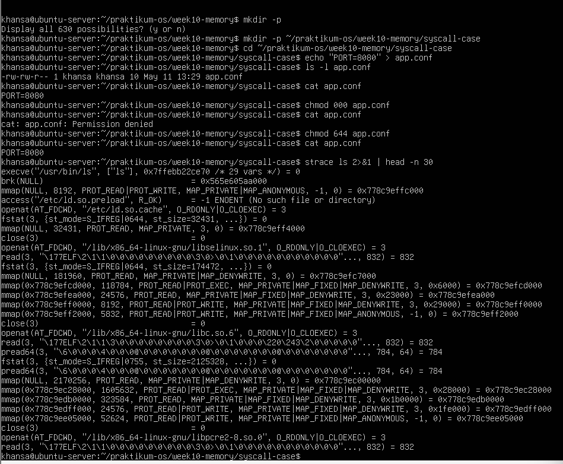

2. Lihat ringkasan statistik dan bandingkan dua direktori berbeda.
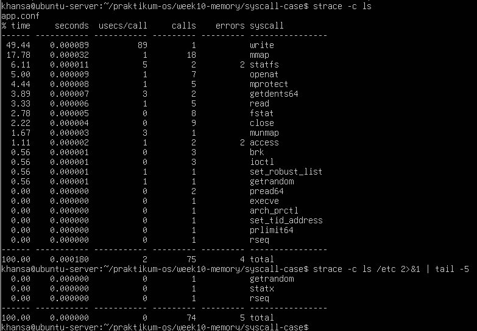

**Analisis:**
1. Dari output Langkah 1, identifikasi minimal 4 system call berbeda. Jelaskan fungsi singkat masing-masing berdasarkan argumen yang terlihat.
    - Jawab: write digunakan untuk menampilkan output hasil ls ke terminal. mmap digunakan untuk memetakan file atau memori ke ruang alamat proses, dipakai saat memuat library. openat digunakan untuk membuka file atau direktori sebelum dibaca. read digunakan untuk membaca isi file yang sudah dibuka. getdents64 digunakan untuk membaca entri-entri dalam direktori satu per satu.

2. Dari ringkasan strace -c, system call mana yang paling sering dipanggil? Mengapa?
    - Jawab: System call yang paling sering dipanggil adalah write dengan 89 kali pemanggilan dan menghabiskan 49.44% waktu eksekusi. Hal ini wajar karena ls harus menampilkan nama setiap file ke terminal satu per satu melalui system call write.

3. Apakah ada system call dengan errors lebih dari 0? Apakah itu berarti program bermasalah, ataukah bagian normal dari logika program?
    - Jawab: Ya, terdapat 4 errors pada strace -c ls. System call yang menghasilkan error adalah statfs (2 errors) dan access (2 errors). Meski ada kegagalan, program tetap berjalan normal karena error tersebut merupakan bagian dari logika normal program — misalnya access mencoba memeriksa beberapa path library secara berurutan dan yang tidak ditemukan dianggap wajar, lalu program melanjutkan ke path berikutnya.

4. Apakah jumlah system call berbeda antara ls dan ls /etc? Faktor apa yang menyebabkan perbedaan tersebut?
    - Jawab: Jumlahnya hampir sama, ls menghasilkan 75 calls sedangkan ls /etc menghasilkan 74 calls berdasarkan tail -5. Namun, jika dilihat penuh, ls /etc sebenarnya lebih banyak karena direktori /etc memiliki jauh lebih banyak file dibanding direktori saat ini, sehingga kernel perlu memanggil getdents64 dan statfs lebih banyak kali untuk membaca metadata setiap file di dalamnya.

## Tugas Praktikum
### Tugas 10.1 Audit Penggunaan Memori Sistem
Instruksi: Buat script memory-audit.sh yang menghasilkan laporan kondisi memori sistem secara otomatis.
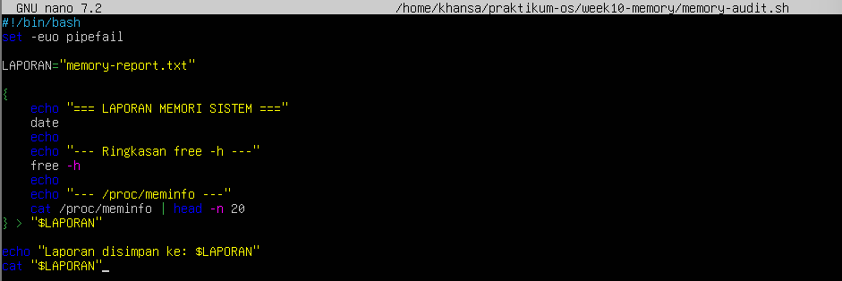
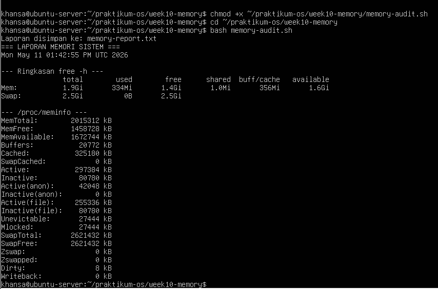

**Analisis:**
1. Hitung persentase memori tersedia (available / total × 100%). Apakah sistem dalam kondisi normal?
    - Jawab: Persentase memori tersedia = 1.672.744 / 2.015.312 × 100 ≈ 83%. Sistem dalam kondisi normal, jauh di atas batas kritis 10%.

2. Mengapa buff/cache tidak dihitung sebagai memori yang terpakai dari sudut pandang ketersediaan untuk aplikasi?
    - Jawab:  Buff/cache tidak dihitung sebagai memori terpakai karena bersifat reclaimable — Linux sengaja menggunakan RAM kosong sebagai cache file/disk untuk mempercepat akses. Kernel akan membebaskan cache ini secara otomatis jika ada aplikasi yang membutuhkan memori. Kolom available sudah memperhitungkan cache yang bisa dibebaskan tersebut.

3. Dari /proc/meminfo, apakah SwapTotal lebih besar dari 0? Berapa nilai SwapFree?
    - Jawab: Ya, SwapTotal = 2.621.432 kB (± 2,5 GB), lebih besar dari 0. Nilai SwapFree = 2.621.432 kB — sama dengan SwapTotal, artinya swap belum digunakan sama sekali dan RAM masih sangat mencukupi.

### Tugas 10.2 Identifikasi Proses dengan Memori Tertinggi
Instruksi: Simpan daftar 10 proses pengguna memori terbesar ke file.
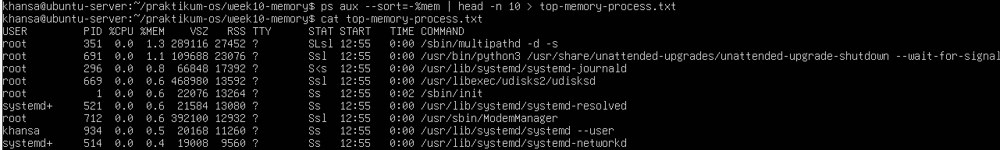

**Analisis:**
1. Proses apa di urutan pertama? Catat nilai %MEM dan RSS.
    - Jawab: Proses di urutan pertama adalah multipathd (PID 351, milik root), dengan nilai %MEM = 1.3 dan RSS = 27.452 kB.

2. Konversikan RSS ke MB (bagi 1024). Apakah wajar?
    - Jawab: Konversi RSS ke MB: 27.452 / 1024 ≈ 26,8 MB. Nilai ini sangat wajar untuk proses multipathd yang merupakan daemon manajemen multipath storage dan memang berjalan terus di background sistem.

3. Jumlahkan %MEM dari 5 proses teratas. Berapa persen RAM yang mereka gunakan bersama?
    - Jawab: Jumlah %MEM dari 5 proses teratas: 1.3 + 1.0 + 0.8 + 0.6 + 0.6 = 4,3%. Sebesar 4,3% RAM digunakan bersama oleh 5 proses teratas, menunjukkan sistem sangat ringan bebannya.

### Tugas 10.3 Membuat dan Memverifikasi Swap File
Instruksi: Buat swap file khusus tugas sebesar 256 MB dan verifikasi.
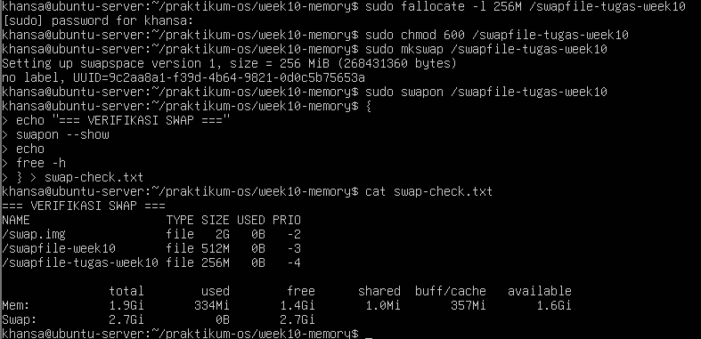

**Analisis:**
1. Identifikasi kolom NAME, TYPE, SIZE, dan USED pada output swapon –show.
    - Jawab: Kolom pada output swapon --show:
        - NAME → /swapfile-tugas-week10, yaitu path file swap yang baru dibuat.
        - TYPE → file, artinya swap berbentuk file biasa bukan partisi.
        -  SIZE → 256M, sesuai ukuran yang dibuat dengan fallocate.
        - USED → 0B, belum digunakan karena RAM masih mencukupi.

2. Apakah nilai total pada baris Swap di free -h bertambah 256 MB?
    - Jawab: Ya, nilai total pada baris Swap di free -h bertambah dari sebelumnya 2,5Gi menjadi 2,7Gi, bertambah ±256MB sesuai swap file yang baru diaktifkan dengan swapon.

3. Mengapa permission 600 penting? Apa risiko jika diatur ke 644?
    - Jawab: Permission 600 penting karena swap file menyimpan potongan data aktif dari memori program, termasuk data sensitif seperti password, token sesi, atau isi dokumen. Jika diatur ke 644, pengguna lain (non-root) bisa membaca isi swap dan mencuri data sensitif tersebut. Permission 600 memastikan hanya root yang bisa membaca dan menulis file tersebut.

### Tugas 10.4 Analisis System Call dengan strace
Instruksi: Analisis system call yang dipanggil perintah ls.
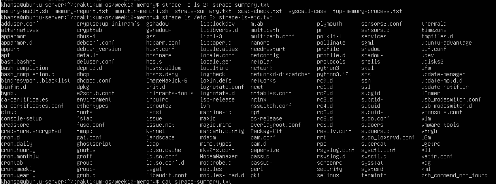
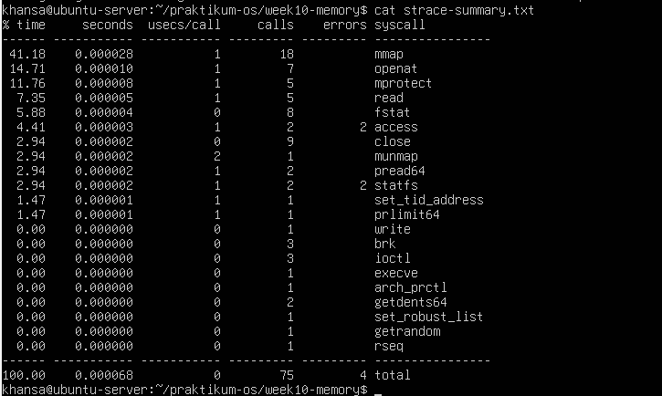

**Analisis:**
1. Sebutkan minimal 5 system call dari strace-summary.txt beserta fungsi singkatnya.
    - Jawab: 5 system call dari strace-summary.txt beserta fungsinya:
        - mmap → memetakan file atau library ke dalam memori proses.
        - openat → membuka file atau direktori.
        - read → membaca data dari file descriptor yang sudah dibuka.
        - close → menutup file descriptor setelah selesai digunakan.
        - execve → menjalankan program ls itu sendiri.
        - getdents64 → membaca isi entri direktori (daftar file di dalamnya).
        - write → menulis output hasil ls ke terminal.

2. System call mana yang paling sering dipanggil? Mengapa?
    - Jawab: System call yang paling sering dipanggil adalah mmap (18 kali, 41,18% waktu). Hal ini karena saat ls dijalankan, kernel perlu memetakan beberapa shared library seperti libc dan ld-linux ke memori proses sebelum program bisa berjalan.

3. Apakah ada errors lebih dari 0? Apakah program tetap berjalan normal meskipun ada kegagalan tersebut?
    - Jawab: Ya, ada 4 errors total yang berasal dari access (2 errors) dan statfs (2 errors). Namun program tetap berjalan normal. Ini bukan pertanda masalah — access dan statfs mencoba beberapa path secara berurutan, dan gagal di path yang tidak ada adalah bagian dari logika pencarian library yang memang by design.

### Tugas 10.5 Studi Kasus Diagnosa Server Lambat
Skenario: Server terasa lambat. Buat script diagnosa yang menggabungkan semua pemeriksaan dari bab ini menggunakan fungsi Bash.
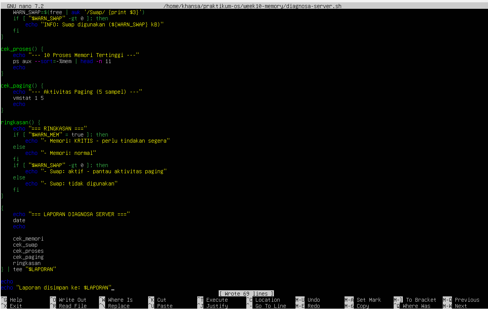
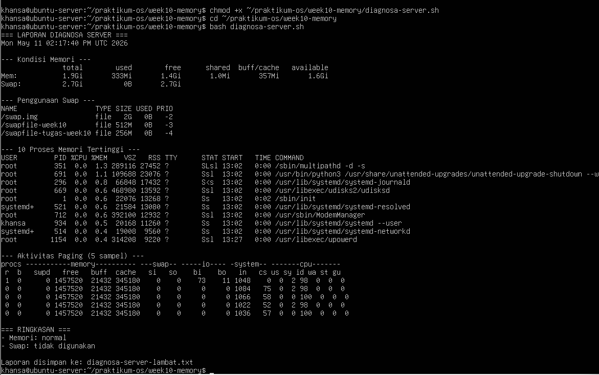

**Analisis:**
1. Jelaskan peran masing-masing fungsi: cek_memori, cek_swap, cek_proses, cek_paging, dan ringkasan. Mengapa diagnosa dipecah menjadi fungsi terpisah?
    - Jawab: Peran masing-masing fungsi:
        - cek_memori → menampilkan kondisi RAM dengan free -h dan menghitung persentase memori tersedia. Jika di bawah 20%, set flag WARN_MEM=true.
        - cek_swap → menampilkan daftar swap aktif dan mengecek apakah swap sedang digunakan. Jika WARN_SWAP > 0, berarti kernel mulai menggunakan swap.
        - cek_proses → menampilkan 10 proses dengan konsumsi memori terbesar untuk mengidentifikasi penyebab memori penuh.
        - cek_paging → menjalankan vmstat 1 5 untuk melihat aktivitas swap in/out secara real-time sebagai indikator ada tidaknya memory pressure.
        - ringkasan → merangkum semua hasil pengecekan berdasarkan flag yang di-set fungsi sebelumnya dalam format mudah dibaca
    - Diagnosa dipecah menjadi fungsi terpisah agar kode modular, mudah dibaca, dan setiap fungsi bisa dimodifikasi secara independen tanpa mengganggu fungsi lain.

2. Berdasarkan bagian RINGKASAN, apakah kondisi sistem normal atau kritis? Jelaskan berdasarkan nilai threshold yang digunakan script.
    - Jawab: Berdasarkan bagian RINGKASAN pada output: "Memori: normal" dan "Swap: tidak digunakan". Kondisi sistem normal karena memori tersedia sekitar 83% (jauh di atas threshold 20%) dan swap sama sekali belum digunakan (0B).

3. Mengapa script menggunakan tee "$LAPORAN" bukan redirection biasa > "$LAPORAN"? Apa keuntungannya?
    - Jawab: Script menggunakan tee "$LAPORAN" karena tee menyimpan output ke file sekaligus menampilkannya di terminal secara bersamaan. Jika hanya menggunakan > "$LAPORAN", output hanya tersimpan ke file tanpa terlihat di terminal, sehingga administrator harus menjalankan cat lagi untuk melihat hasilnya.

4. Dari output cek_paging, apakah ada aktivitas si atau so? Jika ada, apa implikasinya terhadap performa server?
    - Jawab: Dari output cek_paging, kolom si dan so pada semua 5 sampel bernilai 0. Artinya tidak ada aktivitas swap in maupun swap out sama sekali. Ini menunjukkan RAM masih sangat mencukupi, tidak ada memory pressure, dan performa server dalam kondisi baik.