# Laporan Pertemuan 11 Sistem Operasi

<h4>Nama : Deswita Khansa Rafifah<h4>
<h4>NIM : 254107020151<h4>
<h4>Kelas : TI-1G<h4>

## Praktikum
### Praktikum 9.1 — Permissions
1. Buat direktori kerja dan dua file uji.
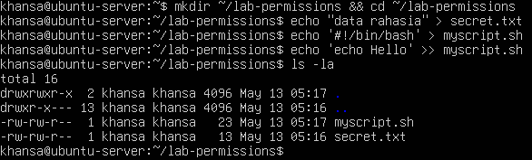

2. Jadikan secret.txt privat hanya untuk owner.
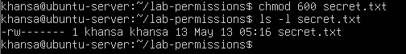

3. Jadikan myscript.sh dapat dijalankan.
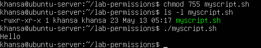

4. Buat direktori bersama dan amati efek SGID sederhana.
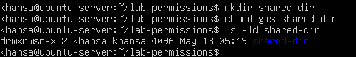

5. Uji efek umask pada file baru.
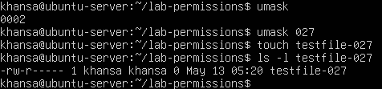

**Analisis**
1. Mengapa secret.txt tidak dapat dibaca oleh group dan others setelah chmod 600?
    - Jawab: Permission 600 dalam notasi oktal berarti owner mendapat rw- (6 = 4+2) yaitu bisa baca dan tulis, sedangkan group mendapat --- (0) dan others mendapat --- (0) yang artinya tidak ada izin sama sekali untuk keduanya. Linux memeriksa identitas pengguna secara hierarkis — pertama dicek apakah user adalah owner, lalu apakah masuk group file, lalu others. Karena group dan others mendapat nilai 0, siapapun selain owner tidak bisa membaca, menulis, maupun mengeksekusi file tersebut.
2. Apa perbedaan arti 600 dan 755 terhadap file yang diuji?
    - Jawab: Permission 600 berarti owner: rw-, group: ---, others: ---. Ini menjadikan secret.txt sebagai file privat yang hanya bisa dibaca dan ditulis oleh owner saja, cocok untuk menyimpan data sensitif. Sedangkan Permission 755 berarti owner: rwx, group: r-x, others: r-x. Ini menjadikan myscript.sh bisa dibaca dan dieksekusi oleh semua user, tetapi hanya owner yang bisa memodifikasi isinya. Cocok untuk skrip atau program yang perlu dijalankan banyak orang.
3. Setelah umask 027, permission apa yang dihasilkan untuk file baru, dan mengapa bukan 777?
    - Jawab: Basis awal file reguler adalah 666, bukan 777, karena Linux tidak pernah memberikan bit execute secara default pada file biasa. Nilai 777 adalah basis untuk direktori. Dari basis 666 dikurangi umask 027 menghasilkan 640, artinya owner rw-, group r--, others ---. Jika file perlu executable, harus ditambahkan manual dengan chmod +x.

**Tantangan**

Ubah owner atau group salah satu file uji ke akun atau group lain yang tersedia di sistem, kemudian jelaskan perubahan output ls -l sebelum dan sesudahnya.
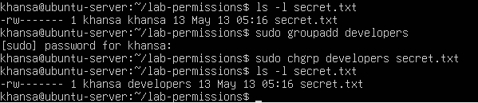
- Output sebelum: -rw------- 1 khansa khansa 14 May 13 05:17 secret.txt
- Output sesudah: -rw------- 1 khansa developers 14 May 13 05:17 secret.txt

Kolom ke-4 yang sebelumnya khansa (group default user) berubah menjadi developers. Permission string -rw------- tidak berubah karena kita hanya mengubah kepemilikan group, bukan izinnya. Meski group sudah berubah ke developers, anggota group tersebut tetap tidak bisa membaca file karena permission group-nya masih --- dari chmod 600 sebelumnya.

### Praktikum 9.2 — ACL
1. Siapkan file dan lihat permission standar tanpa ACL tambahan.
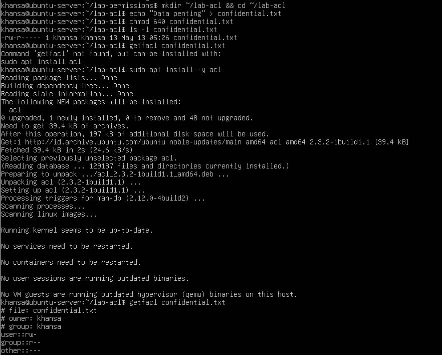

2. Beri akses baca ke satu user tertentu tanpa mengubah owner atau group.
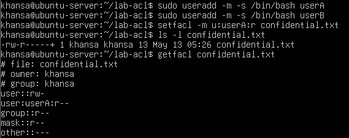

3. Buat direktori bersama yang mewariskan ACL ke file baru.
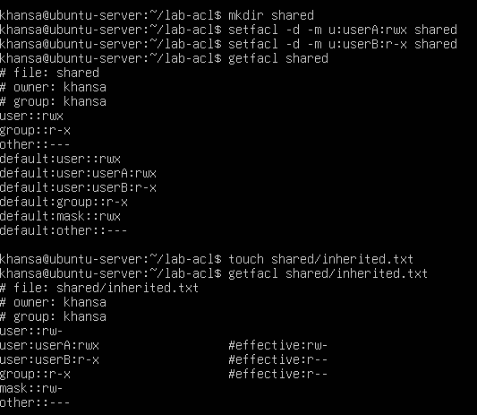

**Analisis**
1. Mengapa getfacl confidential.txt awalnya tidak menampilkan user tertentu?
    - Jawab: Karena file baru hanya memiliki permission Unix standar yaitu owner, group, dan others. ACL tambahan seperti user:userA:r-- baru muncul setelah kita secara eksplisit menambahkannya dengan perintah setfacl -m. Tanpa itu, getfacl hanya menampilkan tiga entri dasar yang sepadan dengan permission Unix biasa.
2. Setelah setfacl -m u:userA:r confidential.txt, apa perbedaan output ls -l dan getfacl?
    - Jawab: ls -l menampilkan tanda + di akhir string permission menjadi -rw-r-----+, yang menandakan ada ACL tambahan tetapi tidak menampilkan detailnya. Sedangkan getfacl menampilkan seluruh aturan ACL secara lengkap termasuk entri baru user:userA:r-- dan mask yang otomatis dibuat yaitu mask::r--.
3. Mengapa file inherited.txt mewarisi ACL dari direktori shared?
    - Jawab: Karena direktori shared diberi default ACL menggunakan opsi -d pada perintah setfacl. Default ACL berfungsi seperti template — setiap file atau subdirektori yang dibuat di dalamnya secara otomatis mewarisi aturan ACL tersebut. Ini terlihat dari entri default:user:userA:rwx dan default:user:userB:r-x pada output getfacl shared.

**Tantangan**

Tambahkan satu ACL lagi agar group readonly-group hanya dapat membaca confidential.txt. Setelah itu, hapus ACL untuk userA dan verifikasi hasil akhirnya dengan getfacl.
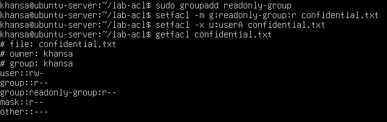
Setelah setfacl -x u:userA, entri user:userA:r-- hilang dari daftar ACL. Kemudian ditambahkan ACL baru untuk group:readonly-group:r-- sehingga hanya anggota group tersebut yang mendapat akses baca tambahan. Tanda + pada ls -l tetap muncul karena masih ada ACL tambahan dari readonly-group.

### Praktikum 9.3A — Membuat dan Mengelola User
Tujuan: membuat user baru, memodifikasi propertinya, dan memahami perbedaan opsi useradd dan usermod.
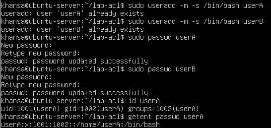
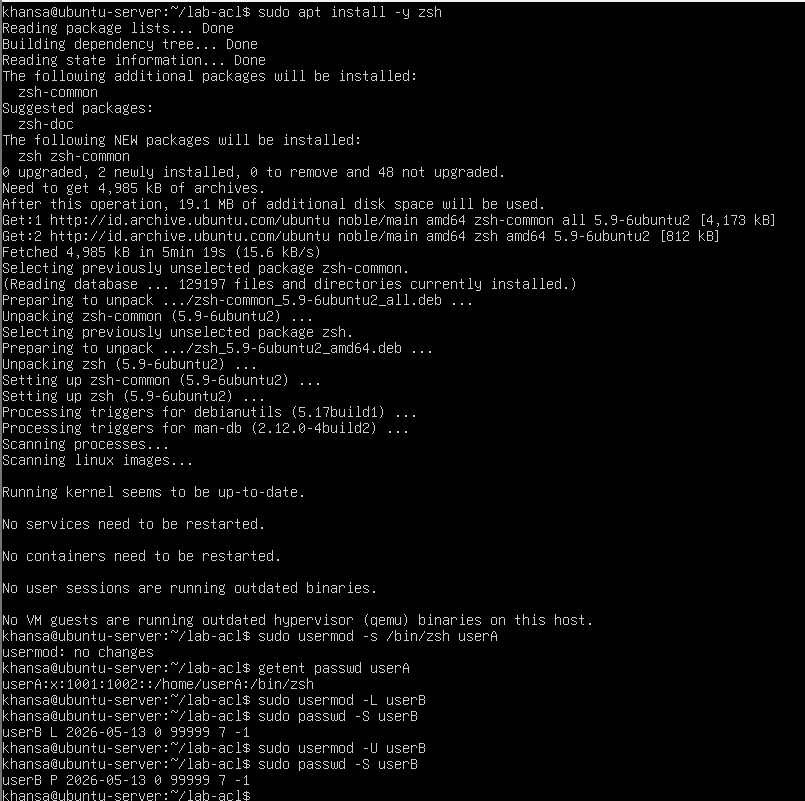

**Pertanyaan:**
1. Apa perbedaan output id userA sebelum dan sesudah menambah group?
    - Jawab: Sebelum ditambah group, output id userA hanya menampilkan primary group saja: uid=1001(userA) gid=1002(userA) groups=1002(userA). Sesudah ditambah ke group tambahan, kolom groups akan bertambah entry group baru. Perubahan ini baru terlihat penuh setelah logout-login atau membuka subshell baru dengan newgrp.
2. Bagaimana status passwd -S userB berubah saat akun di-lock?
    - Jawab: Setelah sudo usermod -L userB, status berubah menjadi userB L 2026-05-13 0 99999 7 -1 — huruf L berarti locked. Secara teknis Linux menambahkan tanda ! di depan hash password di /etc/shadow sehingga autentikasi selalu gagal. Setelah sudo usermod -U userB, status kembali menjadi userB P 2026-05-13 0 99999 7 -1 — huruf P berarti password aktif kembali.

### Praktikum 9.3B — Group Management
Tujuan: membuat group, menambahkan user ke group, dan memverifikasi keanggotaan.
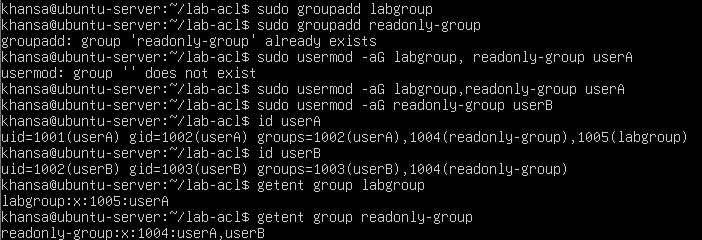

**Pertanyaan:**
1. Apa yang ditampilkan id userA vs groups userA?
    - Jawab: 
        - id userA menampilkan informasi lengkap berupa UID, GID primary, dan semua group beserta nomor ID-nya: uid=1001(userA) gid=1002(userA) groups=1002(userA),1004(readonly-group),1005(labgroup) 
        - groups userA hanya menampilkan nama group saja tanpa UID maupun GID: userA : userA readonly-group labgroup
      
2. Mengapa -a pada usermod -aG penting?
    - Jawab: Opsi -a berarti append (tambahkan). Tanpa -a, perintah usermod -G labgroup userA akan mengganti seluruh daftar supplementary group userA hanya dengan labgroup sehingga semua group lama seperti readonly-group akan hilang. Dengan -aG, group baru ditambahkan tanpa menghapus yang sudah ada.

### Praktikum 9.3C — Password Aging Policy
Tujuan: menerapkan kebijakan umur password dan mengamati efeknya.
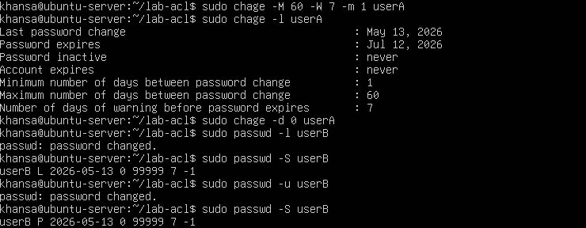

**Pertanyaan:**
1. Apa arti nilai yang ditampilkan chage -l userA?
    - Jawab: Dari output chage -l userA yang terlihat di terminal:
        - Last password change : May 13, 2026 → tanggal terakhir password diubah
        - Password expires : Jul 12, 2026 → password wajib diganti setelah 60 hari dari last change
        - Password inactive : never → akun tidak dikunci otomatis setelah password expired
        - Account expires : never → akun tidak memiliki tanggal kedaluwarsa
        - Minimum number of days between password change : 1 → userA harus menunggu minimal 1 hari sebelum boleh ganti password lagi
        - Maximum number of days between password change : 60 → password wajib diganti maksimal setiap 60 hari
        - Number of days of warning before password expires : 7 → userA mendapat peringatan 7 hari sebelum password expired
2. Bagaimana cara membuktikan userB terkunci dari output passwd -S?
    - Jawab: Setelah passwd -l userB, output passwd -S userB menampilkan userB L 2026-05-13 0 99999 7 -1. Huruf L pada kolom kedua membuktikan akun terkunci. Setelah passwd -u userB, statusnya berubah menjadi userB P 2026-05-13 0 99999 7 -1 di mana huruf P berarti password aktif kembali.
3. Kapan sebaiknya menggunakan chage -d 0 vs passwd -e?
    - Jawab: chage -d 0 mengatur tanggal perubahan password terakhir ke epoch (1 Januari 1970) sehingga sistem menganggap password sudah sangat lama dan memaksa ganti saat login berikutnya. passwd -e langsung menandai password sebagai expired secara instan. Efeknya sama, tetapi passwd -e lebih eksplisit dan mudah dibaca. Keduanya menghasilkan perilaku yang sama yaitu user dipaksa ganti password saat login pertama.

**Tantangan**
- Buat user bernama intern yang:
    -  memiliki shell /bin/bash;
    - menjadi anggota labgroup;
    - dipaksa ganti password pada login pertama;
    - password expired setelah 45 hari dengan warning 7 hari sebelumnya.
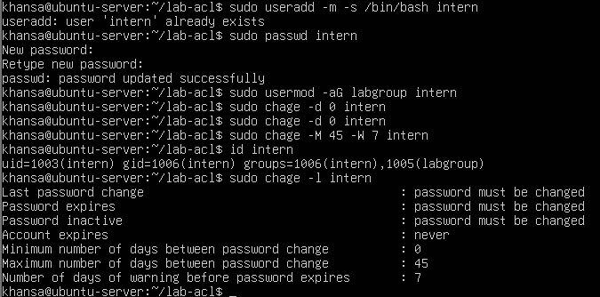

### Praktikum 9.4 — Konfigurasi sudo
1. Buat file konfigurasi sudo khusus untuk userA.
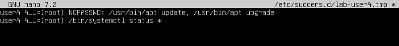

2. Verifikasi aturan yang aktif dan uji hasilnya.
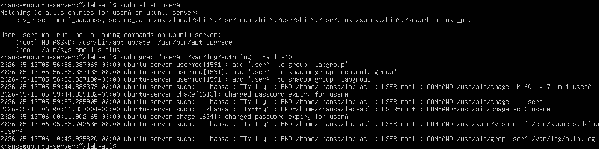

**Analisis**
1. Mengapa aturan disimpan di /etc/sudoers.d//, bukan langsung di /etc/sudoers?
    - Jawab: Menyimpan aturan di /etc/sudoers.d/ lebih aman dan terorganisir karena setiap user atau aplikasi punya file sendiri yang bisa ditambah atau dihapus tanpa menyentuh file utama. Jika terjadi kesalahan sintaks di satu file, hanya file itu yang bermasalah dan tidak merusak seluruh konfigurasi sudo. Ini juga memudahkan audit karena setiap aturan terpisah jelas.
2. Mana perintah yang bisa dijalankan tanpa password, dan mana yang masih perlu autentikasi?
    - Jawab: Dari output sudo -l -U userA yang terlihat di terminal:
        - /usr/bin/apt update dan /usr/bin/apt upgrade → tanpa password karena ada NOPASSWD
        - /bin/systemctl status * → perlu password karena tidak ada NOPASSWD
3. Informasi apa saja yang dicatat di log sudo?
    - Jawab: Dari output grep userA /var/log/auth.log terlihat log mencatat: timestamp, hostname, nama user yang menjalankan sudo (khansa), terminal yang digunakan (TTY=tty1), direktori kerja (PWD), user target (USER=root), dan perintah lengkap yang dieksekusi (COMMAND).

**Tantangan**
- Tambahkan satu aturan baru agar userA boleh menjalankan /bin/systemctl restart ssh tetapi tidak boleh menjalankan reboot.
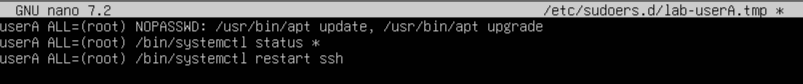
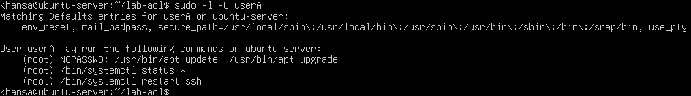

### Praktikum 9.5 — Disk Quota
1. Buat image filesystem kecil dan mount dengan opsi quota.
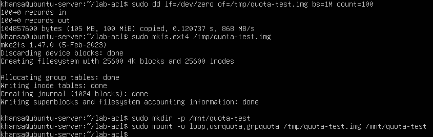

2. Buat database quota dan aktifkan enforcement.
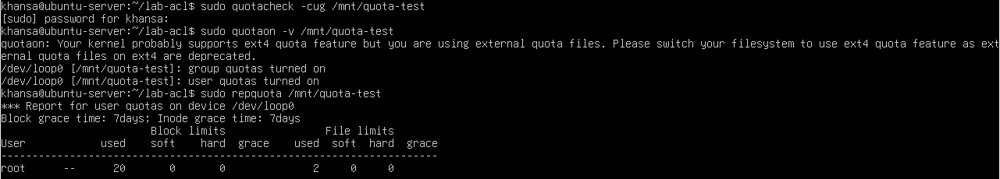

3. Tetapkan quota untuk user uji dan amati hasilnya.
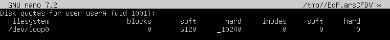
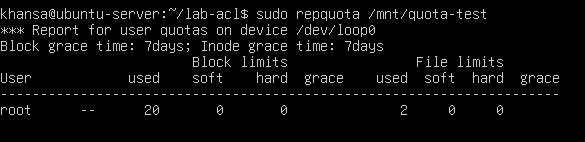

4. Bersihkan lingkungan uji setelah selesai.
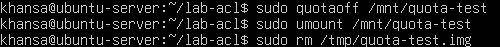

**Analisis**
1. Apa perbedaan soft limit dan hard limit saat quota mulai terlampaui?
    - Jawab: Soft limit boleh dilampaui sementara selama grace period yang defaultnya 7 hari seperti terlihat di output repquota tadi (Block grace time: 7days). Setelah grace period habis, soft limit diperlakukan seperti hard limit dan user tidak bisa menulis data baru. Sedangkan hard limit adalah batas mutlak yang tidak bisa dilampaui sama sekali. Begitu penggunaan mencapai hard limit, sistem langsung menolak penulisan data baru tanpa toleransi apapun.
2. Mengapa praktikum ini memakai loopback filesystem, bukan langsung /home/?
    - Jawab: Karena agar aman, memodifikasi fstab dan mengaktifkan quota di /home/ yang sedang aktif bisa menyebabkan sistem tidak stabil atau data hilang jika terjadi kesalahan. Loopback filesystem berupa image file /tmp/quota-test.img adalah sandbox yang terisolasi. Jika rusak, tinggal dihapus dengan rm tanpa efek apapun ke sistem utama.
3. Dari output repquota, informasi apa yang menunjukkan quota sudah aktif?
    - Jawab: Dari output repquota /mnt/quota-test yang terlihat di terminal, quota sudah aktif ditunjukkan oleh header *** Report for user quotas on device /dev/loop0 dan baris Block grace time: 7days; Inode grace time: 7days. Kolom soft dan hard pada baris userA sudah terisi 5120 dan 10240 yang berarti limit sudah terpasang dan enforcement aktif.

**Tantangan**
- Coba atur quota baru untuk userA dengan batas inode yang sangat kecil, kemudian jelaskan kapan pembatasan inode lebih penting daripada pembatasan block.
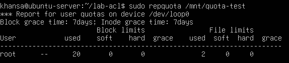
Pembatasan inode lebih penting dari block quota saat pengguna membuat sangat banyak file kecil, misalnya file cache aplikasi, temporary files, atau file log yang ukurannya masing-masing sangat kecil. Ruang disk dalam satuan blok mungkin masih banyak tersisa, tetapi inode yang habis membuat sistem tidak bisa membuat file baru sama sekali meskipun masih ada ruang kosong.

## Latihan
### Latihan 9.A — Audit dan Kolaborasi
1. Temukan file SUID aktif dengan find / -perm -4000 -type f 2>/dev/null, lalu jelaskan tiga file yang Anda kenali beserta alasannya.
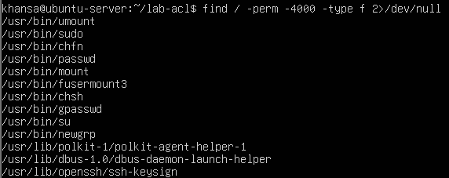
Dari output terminal, tiga file SUID yang ditemukan dan penjelasannya:
    - /usr/bin/passwd — Perlu SUID agar user biasa bisa mengubah password mereka sendiri. File ini perlu menulis ke /etc/shadow yang hanya bisa diakses root, sehingga SUID memungkinkan proses berjalan dengan privilege root sementara.
    - /usr/bin/sudo — Perlu SUID agar bisa menjalankan perintah dengan privilege root berdasarkan aturan di /etc/sudoers. Tanpa SUID, sudo tidak bisa mengeskalasi privilege sama sekali.
    - /usr/bin/su — Perlu SUID agar bisa berpindah ke akun lain termasuk root dengan autentikasi password target. Proses perlu mengakses /etc/shadow untuk memverifikasi password.

2. Cari direktori world-writable dan tentukan mana yang valid dan mana yang berisiko.
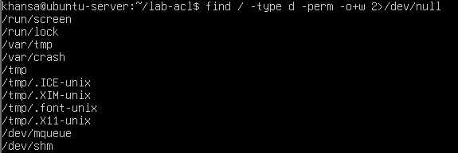
- Valid: /tmp, /var/tmp, /var/crash, /run/lock, /dev/mqueue, /dev/shm, /tmp/.ICE-unix, /tmp/.XIM-unix, /tmp/.font-unix, /tmp/.X11-unix — direktori-direktori ini memang dirancang world-writable dan umumnya memiliki sticky bit sehingga user hanya bisa menghapus file miliknya sendiri.
- Berisiko: /run/screen — direktori ini world-writable tanpa konteks yang jelas dan perlu dicek apakah memiliki sticky bit dengan ls -ld /run/screen.

3. Rancang konfigurasi permission standar dan ACL untuk direktori proyek /srv/webapp/ agar group webapp-team dapat menulis, user deploy hanya membaca, dan file baru selalu mewarisi group proyek.
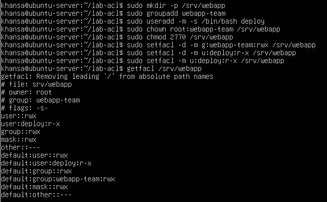

###  Latihan 9.B — Kebijakan Akun dan Quota
Tuliskan langkah untuk membuat user intern, menambahkannya ke group labgroup, memaksa pergantian password tiap 45 hari (warning 7 hari), memberi izin sudo hanya untuk systemctl status, dan menetapkan quota ruang serta inode sederhana pada /home/.
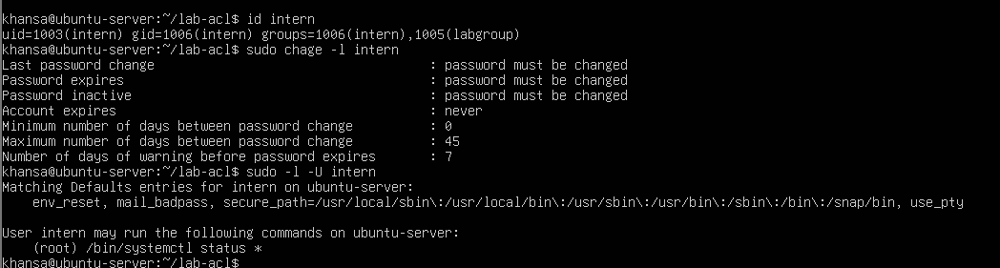
Langkah-langkah:
1. Membuat user intern dengan home directory dan shell bash, lalu set password.
2. Menambahkan intern ke group labgroup tanpa menghapus group lama menggunakan flag -a.
3. Memaksa ganti password saat login pertama dengan mengatur tanggal last change ke epoch.
4. Menetapkan password expired tiap 45 hari dengan peringatan 7 hari sebelumnya.
5. Memberi izin sudo hanya untuk melihat status service melalui file sudoers terpisah.
6. Menetapkan quota dengan soft limit 500MB dan hard limit 1GB untuk ruang disk, serta soft limit 5000 dan hard limit 10000 untuk inode pada /home.